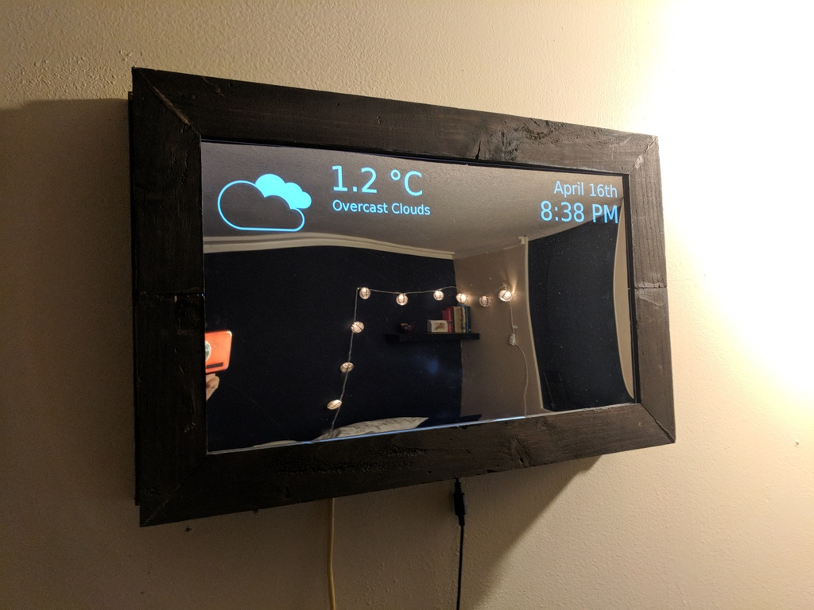
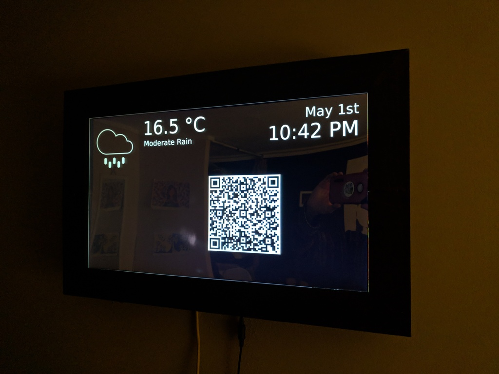
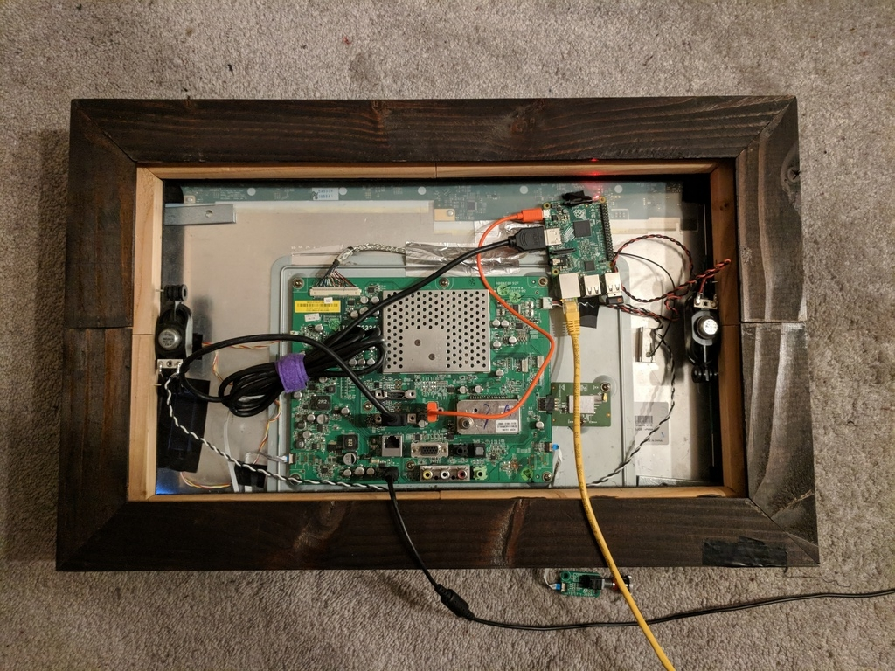
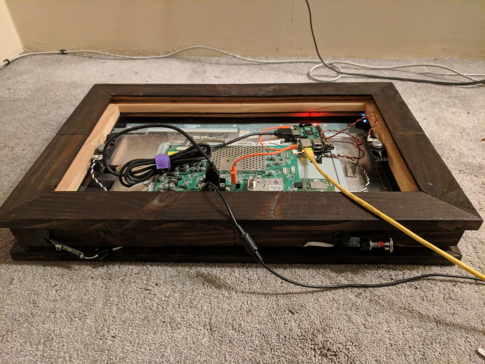

# LiteGlass-v2
A mirror with a UI that displays time, date, and weather information.
The UI can also display a QR code for synchronizing with smart devices and scheduling applications, for instance, deactivating an alarm clock app by scanning a QR code.
Also features a light or dark theme.






Inspired by [MichMich](https://github.com/MichMich)'s [Magic Mirror](https://github.com/MichMich/MagicMirror).

Weather updates are provided by [OpenWeather](http://openweathermap.org).

An older Pythonic version of the project is available [here](https://github.com/DiegoVinasco/LiteGlass-Python).


## Materials
This mirror is constructed from a:
* Raspberry Pi 2
* Visio 21" HD TV
* Acrylic 1-way mirror
* A wooden frame (made with simple pine and some varnish)

## Installation
First, install xautomation and git on the Raspberry Pi
```bash
sudo apt-get install xautomation
sudo apt-get install git
```

Clone this repository
```bash
cd home/pi
git clone https://github.com/DiegoVinasco/LiteGlass-v2/
```

Edit the following lines of the HTML document to configure the application
```javascript
var country     = "";   // the country code for http://api.openweathermap.org
var city        = "";   // the city code for http://api.openweathermap.org
var unit        = "";   // the unit code for http://api.openweathermap.org
var apikey      = '';   // the api key for http://api.openweathermap.org
var alarm_start = 6;    // start displaying qr code at this time
var alarm_stop  = 8;    // stop displaying qr code at this time
var darkTheme   = true; // light or dark theme
``` 

Edit your Raspberry Pi autostart file to open the program on startup
```bash
sudo nano /etc/xdg/lxsession/LXDE-pi/autostart
```

Add a new line with the path to the `run.sh` project file
```bash
home/pi/LiteGlass-v2/run.sh
```

Now the application should start up automatically
